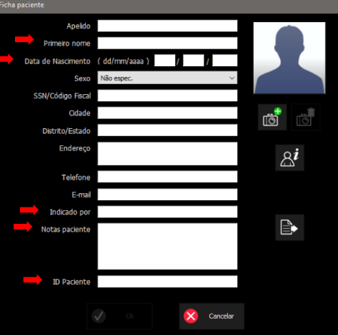

# Acolhimento de Pacientes

O processo de acolhimento varia conforme a **origem do paciente**, e cada origem utiliza um software específico:

- **Paciente Interno** (triagem realizada no HEO): utilizar o sistema **AGHUSE**  
  *  Acesso: [https://aghuse.odonto.ufrgs.br](https://aghuse.odonto.ufrgs.br)

- **Paciente Externo - Prefeitura de Porto Alegre**: utilizar o sistema **Gercon**  
  * Acesso: [https://gercon.procempa.com.br](https://gercon.procempa.com.br)

- **Paciente Externo - Prefeitura de Viamão**: utilizar o sistema **GOVBR Saúde**  
  * Acesso: *[https://viamao.celk.com.br](https://viamao.celk.com.br)*

Os passos a seguir devem ser seguidos para todos os pacientes, independentemente da origem:

---

## 1. Preenchimento tabela **Planilha de Exames 2025**

- Criar um ID sequencial, com base no último ID utilizado para o tipo de exame correspondente (último ID + 1).
- Preencher os seguintes campos obrigatórios:
  - ID
  - Nome Completo
  - Data de Nascimento
  - Origem (Triagem, Prefeitura POA, Prefeitura Viamão)

---

## 2. Preenchimento no software NNT

A seguir estão as orientações para preenchimento da ficha do paciente no software NNT.

### Campos obrigatórios e como preenchê-los

####  Primeiro nome
- Preencher com o nome completo do paciente.

#### Data de Nascimento
- Formato: `dd / mm / aaaa`

#### Indicado por
Selecionar conforme a origem do paciente:
- Prefeitura de POA
- Prefeitura de Viamão
- Especialização de Ortodontia (outras)
- Clínica I
- Clínica II
- Clínica III
- Clínica IV
- Extensão
- Nome do professor responsável

#### Notas paciente
Registrar os exames solicitados:
- TC  
- PAN  
- Tele Frontal  
- Tele Lateral  
- Mão e Punho 
- Outras técnicas extrabucais: *Waters, Lateral Oblíqua*  

Registrar a justificativa:
- **Justificativa:** incluir a razão do exame, se aplicável

#### ID Paciente
- Informar o número de identificação que consta na **planilha de registro Excel** do acolhimento do Serviço de Radiologia.

---

Após preencher todos os campos, clique em **OK** para salvar ou **Cancelar** para descartar as alterações.
