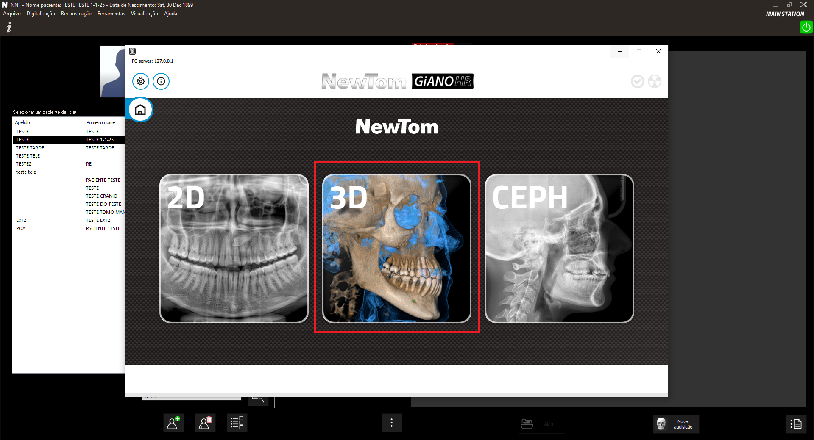
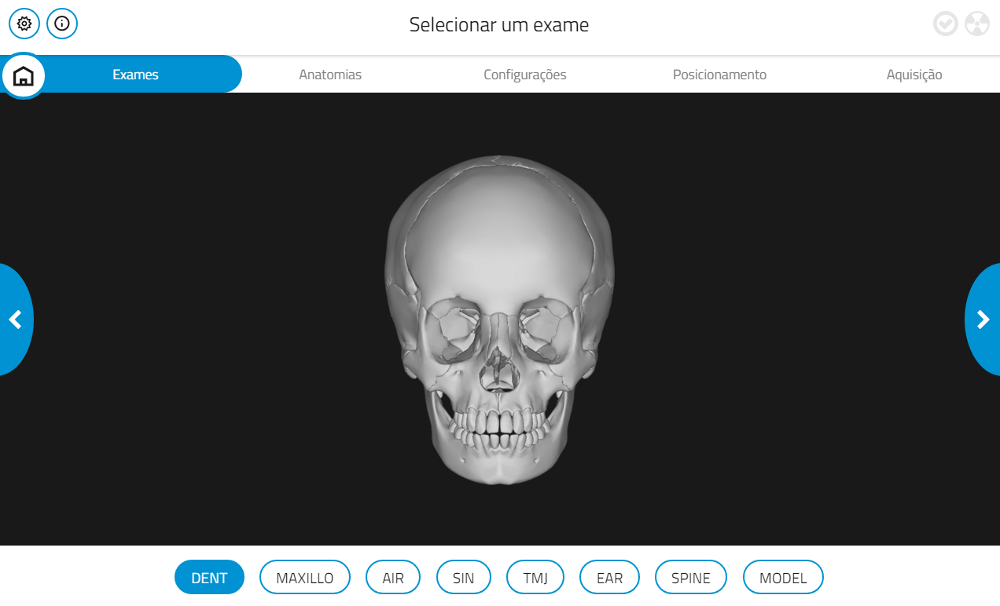
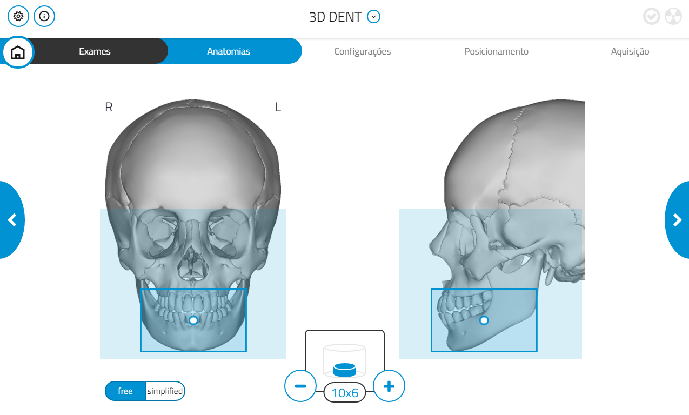
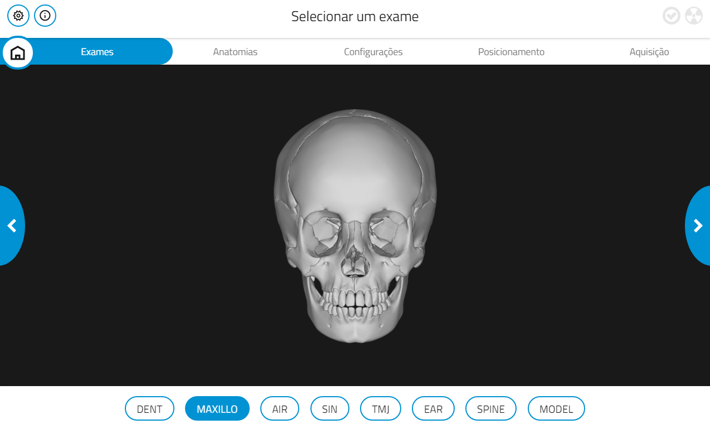
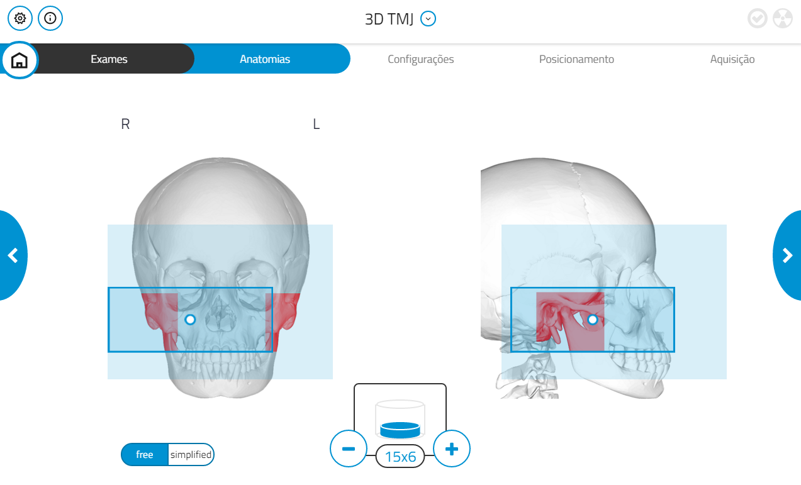
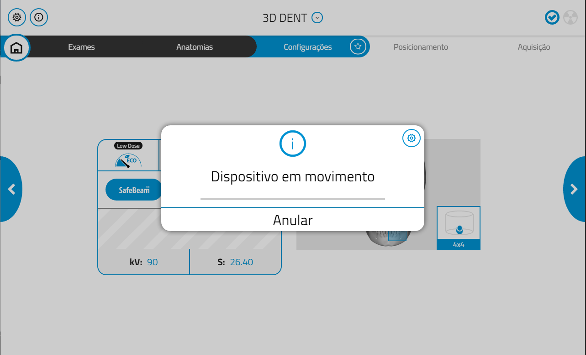
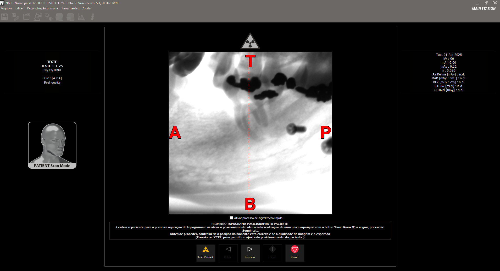
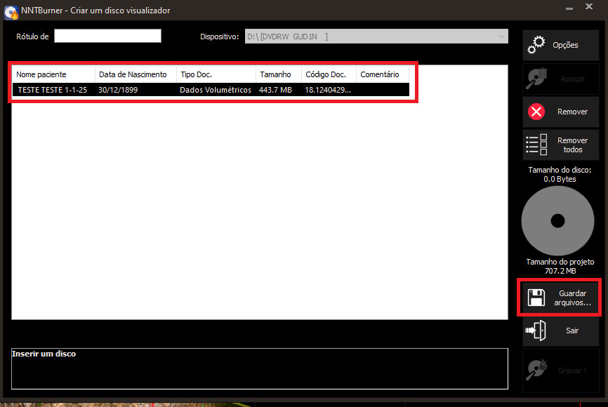

# Aquisição de Exames - Tomografia (Software NNT)

---

## 1. Seleção da opção "3D"

Abra o programa **NNT** e selecione a opção **"3D"**, representada pela imagem abaixo:



---

## 2. Escolha do Exame

Selecione o exame desejado:


---

## 3. Escolha da Região Anatômica

Escolha entre as duas opções disponíveis:

### Região anatômica "Free"

- Permite definir manualmente a área onde o exame será realizado.
- O **FOV** (campo de visão) pode ser ajustado com os botões **"-"** e **"+"**, sendo **4x4** o menor valor possível.


---

### Região anatômica "Simplified"

- Possui áreas pré-definidas para a realização do exame.
- O FOV também pode ser ajustado com os botões **"-"** e **"+"**, sendo **4x4** o valor mínimo.


### 3.1 Variações de FOV

<details>
  <summary>Clique para visualizar as variações do FOV</summary>
   
  ### Dentição

  - **Dent (Geral):**  
    

  - **Dent 4x4:**  
    

  - **Dent 6x6:**  
    

  - **Dent 8x6:**  
    

  - **Dent 8x8:**  
    

  - **Dent 10x6:**  
    

  - **Dent 10x8:**  
    

  - **Dent 10x10:**  
    

  - **Dent 13x8:**  
    

  - **Dent 13x10:**  
    

  ---

  ### Maxilar

  - **Maxilo (Geral):**  
    

  - **Maxilo 13x10:**  
    

  - **Maxilo 13x14:**  
    

  - **Maxilo 13x16:**  
    

  - **Maxilo 16x10:**  
    

  - **Maxilo 16x18:**  
    

  ---

  ### Articulação Temporomandibular (TMJ)

  - **TMJ (Geral):**  
    

  - **TMJ 4x4:**  
    

  - **TMJ 6x6:**  
    

  - **TMJ 7x6:**  
    

  - **TMJ 8x8:**  
    

  - **TMJ 15x6:**  
    

</details>

---

## 4. Configuração de Qualidade

Selecione a opção **"Best Quality"** para garantir a melhor definição da imagem.


---

## 5. Reset do Aparelho

1. Um aviso será exibido informando que o apoio para o queixo será movido.  
   - Se o paciente estiver posicionado, remova-o antes de continuar.
   - Clique em **OK**.

   

2. Confirme o reset clicando novamente em **OK** e aguarde a execução do procedimento.

     
   

---

## 6. Posicionamento do Paciente

Após o reset, posicione o paciente corretamente no aparelho.

Alinhe os lasers de referência conforme a imagem abaixo:


### Orientações por região

#### Maxila
- Posicione o **bloco de mordida**.
- Deixe o **palato duro paralelo ao solo**.
- O **plano mediano sagital (PMS)** deve estar **perpendicular ao solo**.

#### Mandíbula
- A base da mandíbula deve estar **paralela ao solo**.
- O **PMS** também deve estar **perpendicular ao solo**.

---

## 7. Testes de Scout

Realize os testes de Scout, que são imagens iniciais usadas para o planejamento do exame.

1. Execute o **Scout Lateral**:

   

2. Clique em **Próximo** para realizar o **Scout Póster-Anterior**:

   

3. Se necessário, ajuste o contraste com os indicadores na imagem:

   

4. Para centralizar a área de interesse:
   - Pressione **Ctrl + botão esquerdo do mouse** sobre a linha pontilhada.

Se tudo estiver correto, clique em **Iniciar** para dar prosseguimento ao exame.

---

## 8. Realização do Exame

Clique no botão **Iniciar** para começar a aquisição do exame.


Após a aquisição, verifique se o exame foi realizado corretamente.  
Se estiver tudo certo, siga para a etapa de exportação.

---

## 9. Exportação da Tomografia

1. No menu superior, clique em **Arquivo**.
2. No menu lateral, selecione:
   ```
   Gravação disco (CD/DVD) → Gravar disco c/ visualizador
   ```
   

3. Na janela que será aberta:
   - Selecione o paciente na lista.
   - Clique em **Guardar arquivos**.

   

4. Na próxima janela:
   - Selecione **Desktop (Área de Trabalho)**.
   - Clique em **OK**.

   

5. Por fim, vá até a Área de Trabalho e arraste o arquivo para:
   ```
   Radiografias HEO (Z) → @Tomografia
   ```

---